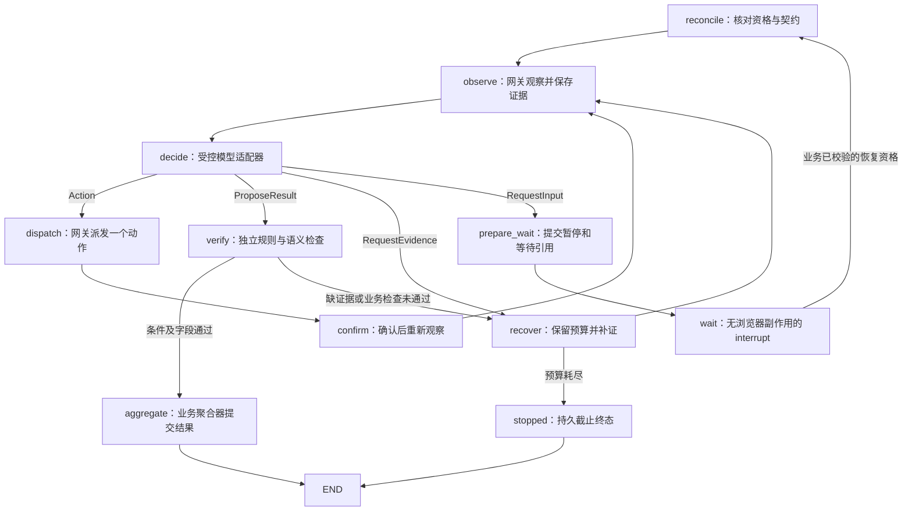

# LangGraph 观察、决策、动作与验证循环

M1-16 将已有模型适配器、动作网关、证据服务和验证器串成自定义 `StateGraph`。正常 Worker 已注册图执行器，持久队列为准备完整、已冻结配置并由可信内部代码入队的 Run 发放资格。任务创建 API 仍只生成任务卡；公开启动、补参后继续和重跑入口按 M1-18 接入。

## 从哪里读代码

| 文件 | 职责 |
| --- | --- |
| `backend/webagent/graph/models.py` | 固定图／状态版本和只含引用的图状态；模型输出槽不能被序列化 |
| `graph/store.py` | 核对契约、状态版本、执行资格和业务事件，保存幂等检查点与追加进度 |
| `graph/context.py` | 只取当前脱敏观察和已验证检查点，检查原始工件链，构造模型输入 |
| `graph/source.py` | 从实际原始字节定位业务字段；可以替换为受信任站点适配器 |
| `graph/runtime.py` | 异步图节点、四种输出分派、补证、等待与终态聚合 |
| `graph/executor.py` | 使用 Run 的固定配置装配模型、受管会话、网关、验证器和图 |
| `graph/routes.py` | 认证后的只读进度分页；不接收执行指令 |
| `backend/webagent/worker.py` | 在独立 AsyncSqliteSaver 生命周期内运行队列和执行器 |

建议按 `models → store/context → source → runtime → executor → worker` 阅读。浏览器实际操作仍由 `gateway/` 执行；图节点没有页面写入工具，也没有注册评测真值或环境管理工具。

## 图节点怎样配合



`reconcile` 清除上个进程的临时输出，核对冻结契约、图版本、资格和网关会话范围。`observe` 通过网关取得当前页面；首次业务导航同样经过网关并计入动作预算。`decide` 只调用既有模型适配器，程序随后分派经过校验的输出。

| 模型输出 | 程序处理 |
| --- | --- |
| `Action` | 只派发一个与当前快照绑定的原子动作，再观察真实页面变化 |
| `RequestEvidence` | 进入补证路径，重新观察；不放宽契约条件或清零预算 |
| `ProposeResult` | 进入 VERIFYING，由可信源适配器提供字段位置，再独立验证 |
| `RequestInput` | 提交 PAUSED 和持久等待事件，再中断；不直接改写冻结契约 |

动作的 `COMPLETED` 表示网关获得了原子动作回执。页面加载、模型声称完成和图到达 `END` 都不是成功证据。只有 M1-15 的业务聚合器能提交成功／部分结果；聚合时重读条件、原件、未决写入和当前资格。

验证不足时，图通过可信事务从 VERIFYING 回到 RUNNING，并刷新同一执行资格的状态版本。补证按同一未解决子目标扣持久恢复预算；模型调用、导航和观察也继续使用原 Run 的计量。图节点没有通用 RetryPolicy，不能在框架重试中绕过次数、站点节奏或独立截止。首次导航、恢复新会话导航与模型导航都遵守持久站点间隔。

补证被预算拒绝时，如果仍有当前 VERIFYING 的完整检查胶囊，聚合器可交付已核验部分并保留失败条件和预算缺口，期间不再调用模型或浏览器。没有可用检查或独立截止已撤销资格时，沿用 M1-11 的持久 FAILED 终止，不能提升为成功。

## 字段解析的适用范围

当前通用源适配器支持页面可见正文是**完整 JSON 文档**的情况，也可定位已保存的结构化原始工件。网关保存的原件包含实际标题及正文，验证器在核验原始字节和哈希后，严格解析整个正文并暴露 `/parsed_text/...` 字段位置。重复键、非有限数值、混入其他文字或被截断的 JSON 不产生可信结构化事实。

适配器只生成 `FieldBinding` 的位置引用。候选字段的值是否相符、对象与来源是否正确，仍由验证器比较实际原件决定；模型候选和脱敏展示副本不会被复制成原始证据。代码中没有固定网站答案。任意普通 HTML、PDF、图像以及业务站点的语义抽取需要后续站点适配器；当前读取闭环的合成 JSON 网页不证明这些站点已经可用。

## 上下文和已验证进度

每次模型输入包含冻结契约、当前 M1-14 脱敏观察、一个业务检查点和允许的动作协议。观察必须完全匹配持久 FILTERED 视图，上下文层不再次截断或修改它。历史对话、模型回复和原始敏感正文不进入输入。

检查点中的 `verified_item_ids` 与 `pending_item_ids` 是冻结验收条件的 ID，`current_subgoal` 指向待完成条件。它们来自最新持久验证记录中的真实 PASS，后来的失败／冲突不能被旧 PASS 隐藏。图中 `verified_summary_refs` 只引用该验证记录；摘要及条件 ID 本身不是证据，最终验证仍须读取原始工件。

`GraphState` 只保存 Run／契约／状态版本、已提交业务事件、`business_checkpoint_id`、快照／证据／等待引用和有界计数／诊断。配置秘密、执行 Token、浏览器对象、完整动作和模型回复只保留在进程内运行依赖中，不能序列化成图状态。模型检查点的 `evidence_ids` 只含经过核验的展示引用，受限原件仍保存在本机证据域。

## 读取结构化进度

```text
GET /v1/runs/{run_id}/progress?after=0&limit=100
```

响应包含 `run_id`、`progress`、`next_after` 和当前暂停的 `input_request`；后者保存 `wait_id` 与有界 `requested_fields` 名称列表，不保存模型原始原因文字。每行保留 `progress_id`、阶段、Run 状态版本、契约／图版本、已提交 `business_event_id`、检查点／快照／验证／等待引用、迭代数和受限诊断。用 `next_after` 继续分页；`limit` 范围为 1～1000。

接口继承本机 Bearer、精确 Host／Origin 及 no-store 保护，不返回原件路径、提示词或框架内部消息。`graph_progress` 是业务库追加表，关联真实当前业务事件并保护历史；框架流式输出不直接作为 SSE 审计事件。任务状态和结果分别从既有业务事件及 `/v1/runs/{run_id}/result` 读取。

## 启动、依赖和恢复边界

`./scripts/dev.sh worker` 现在报告 `mode=scheduled`、`executor_registered=true` 和 `task_execution_enabled=true`，表示内部图执行器已装配。`configured_tasks_only=true` 与 `read_only_tasks_only=true` 描述当前范围，`model_ready` 单独报告模型设置是否就绪。未配置模型时 Worker 仍可启动和维持健康；RUNNING 阶段配置、身份复核或写入适配器不足的 Run 会持久暂停。尚处 RECONCILING 的任务保持恢复阻塞，不能假称已核验后进入 RUNNING。

API 健康字段仍说明当前 HTTP 产品入口的能力。Worker 注册执行器不等于任意 API 调用者可以创建、入队或继续一个 Run。默认身份任务还需要可信的网关身份复核注入；旧登录记录不能替代当前浏览器身份证明。模型供应商始终从 `run_config_snapshots` 解析，修改最新设置不会改变已有 Run。

图库由固定版本的 `AsyncSqliteSaver` 单独管理。图使用 `thread_id=run_id`，固定 `graph_version=browser-loop-v1` 与 `state_schema_version=browser-loop-state-v1`，每次异步调用显式设置 `durability="sync"`。业务结算已撤销资格后，Worker 只给最后的图保存／客户端关闭有界清理时间，网关仍拒绝旧资格；新代号、异常失权和超时清理会取消执行器。业务节点先提交事实，再返回引用；这不构成业务库、图库和网页的联合事务。

FR-01 的新进程恢复覆盖已持久登记、无副作用的 `wait` 中断：新进程先取得经过业务校验的资格，再核对版本和事件，重建依赖、观察并重新决策。旧动作和模型回复不会从 checkpoint 重放。M1-17 已增加非等待节点崩溃、双库提交窗口、浏览器存活／丢失后的重建及 FR-02 故障注入，详见[恢复说明](recovery.md)；公开暂停／继续控制属于 M1-18；外部写入与未确认写入查证属于 M1-23。

## 验证入口

```sh
PYTHONPATH=backend PLAYWRIGHT_BROWSERS_PATH=.cache/ms-playwright \
  .venv/bin/python scripts/verification/verify_graph.py \
  --output-dir /tmp/webpilot-graph-verification
```

该探针使用隔离业务库／图库、自有 HTTP 页面、真实 Chromium 和可替换的本机模型协议服务，覆盖读取、错误页面、关键字段缺失、持续补证、持久等待以及两个真实 Python 进程间的安全恢复。统一入口 `./scripts/check.sh` 包含该探针；当前统一报告写入 `artifacts/verification/M1-17/`，最终通过范围以本轮验收报告和 M1 清单为准。它不访问默认用户数据、付费模型或独立评测答案。

框架中断和同步持久化语义核对了 [LangGraph interrupt 文档](https://docs.langchain.com/oss/python/langgraph/interrupts)与[持久化文档](https://docs.langchain.com/oss/python/langgraph/persistence)；本项目按锁定版本的本地实现和真实探针验证调用边界。
