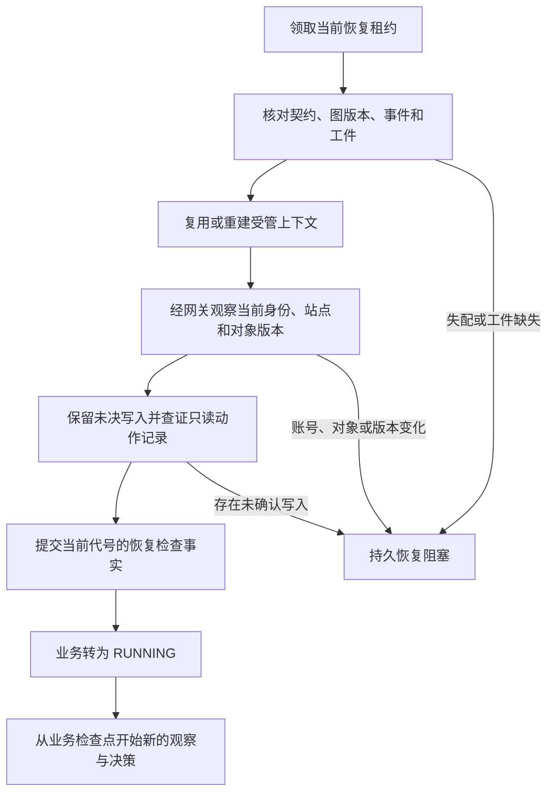

# 两类检查点与只读崩溃恢复

M1-17 在 M1-16 的图循环之上增加重启恢复。业务 SQLite 保存任务状态、动作、证据、预算和控制权；独立的 LangGraph SQLite 只保存这些事实的引用。业务节点先提交短事务，再返回图输出；`AsyncSqliteSaver` 使用 `durability="sync"`，在下一图步骤开始前等待保存。两次提交之间仍可能崩溃，恢复流程专门处理这段窗口。

## 按什么顺序读代码

| 文件 | 作用 |
| --- | --- |
| `graph/recovery.py` | 查证图引用与业务事实，保存恢复检查记录、对象版本和业务检查点 |
| `db/sql/0016_graph_recovery.sql` | 追加不可覆盖的恢复记录与只读动作查证引用；旧迁移保持不变 |
| `graph/executor.py` | 领取 RECONCILING 后组织浏览器重建、身份与对象查证 |
| `gateway/service.py`、`gateway/browser.py` | 恢复阶段的专属只读观察与 GET 导航，仍校验资格、来源及原预算 |
| `sessions/manager.py` | 区分当前恢复访问和普通运行访问，复用存活上下文或重建丢失上下文 |
| `graph/runtime.py` | 查证通过后从业务事实重建图；修复业务已终态但图库落后的引用 |
| `scheduler/store.py`、`scheduler/worker.py` | 撤销旧代号，持久阻塞有问题的恢复，继续处理其他可领取任务 |
| `scripts/verification/verify_recovery.py` | 真实进程终止和双库故障验收 |

## 恢复入口

Worker 重启后，原执行资格被撤销，未完成 Run 进入 `RECONCILING`。持久队列先取得活跃槽及完整资源租约，执行器才开始恢复。固定 `thread_id=run_id`、`graph_version=browser-loop-v1`、`state_schema_version=browser-loop-state-v1`；修改最新配置不会更换原 Run 的模型快照。



旧图库是线索，不能恢复旧权限、预算或模型输出。包括持久等待在内，恢复必须有当前代号下的完整业务查证记录。锁定版本的 LangGraph 在收到新输入后丢弃原待执行任务，从 START 开始核对；不会用 `None` 或旧 Action 重入 `dispatch`。已查证的等待通过原 wait 引用恢复，随后重新观察和决策。

存活浏览器可继续观察当前页面；浏览器关闭或新进程将旧会话登记为 LOST 时，创建同 Run、来源、账号域下的新隔离上下文。重建导航使用最后确认的允许 URL，经过恢复网关、来源校验、站点节奏和动作／内容页预算。Cookie 的恢复不证明账号仍相同，必须从当前原始证据重新核对。

## 什么可以复用

业务检查点关联真实业务事件、当前子目标、已验收条件、待办条件、对象及版本、动作序号、预算记录、身份引用、未确认写入和证据。已验收条件来自实际最新验证胶囊，后来失败不能被早期 PASS 隐藏。摘要不代替原始工件，恢复和最终聚合仍检查原件可用性与哈希。

已完成动作和已扣预算保持原记录。每次崩溃恢复在当前 Run／代号下以稳定 attempt 登记一次 `worker_interrupted`，扣一次动作及当前子目标的恢复额度；重复调用不重复扣除。正常等待续跑不算崩溃恢复。恢复新增的观察、导航及模型调用按实际计量。缺少回执的只读动作保留原 INTENT／UNKNOWN 和失败历史，追加与新观察绑定的查证事实，随后重新决策。末次点击不会被自动重放；新导航也不能伪装成原点击的成功回执。

外部写入 INTENT／UNKNOWN 及隔离锁继续保留，M1-17 不替它们判定“没有发生”或重试提交；查证三分支属于 M1-23。持久人工控制权未交还时，自动程序不能读取或操作会话。

图／业务事件失配、账号变化、对象或版本变化、原件损坏等情况提交恢复阻塞原因，撤销执行资格。队列跳过仍被阻塞的 Run，避免每次轮询重复查证或消耗预算。认证后的 `GET /v1/runs/{run_id}/recovery?after=0&limit=100` 可分页读取恢复阶段、代号、业务事件引用和固定诊断；不返回账号、证明正文或执行 Token，也不能解除阻塞。公开暂停、继续、补参和关联重跑入口仍属于 M1-18。

## 业务已结束但图库落后

聚合器可能已提交结果和终态，进程却在最终图保存前退出。Worker 启动时会检查这种 Run：仅在结果、事件、版本及证据仍完整时，将当前终态引用同步到原 thread。这个入口不申请新执行资格，不调用模型／浏览器，也不重复写业务事件、结果或预算。

存储失败不能提升为成功。图库无法保存时保留业务事实与故障；证据缺失时报告恢复阻塞。当前页面和框架 END 都不构成成功，终态仍由独立业务聚合器产生。

## 验证

```sh
PYTHONPATH=backend PLAYWRIGHT_BROWSERS_PATH=.cache/ms-playwright \
  .venv/bin/python scripts/verification/verify_recovery.py \
  --output-dir /tmp/webpilot-recovery-verification
```

统一入口 `./scripts/check.sh` 使用隔离数据库、自有网页和合成模型服务。测试在真实子进程的模型、页面动作、证据、业务提交、节点返回及 saver 保存窗口终止执行，另外覆盖存储失败、版本与事件失配、账号／对象变化、控制权和未决写入。失败报告也保留，最终通过范围以 [M1 清单](../m1/README.md)和本轮验收报告为准。

当前默认对象解析覆盖完整可见 JSON 中的明确对象字段及已支持的场景结构。普通 HTML、PDF、图像和各业务站点需要提供受信任、基于原始证据字段位置的适配器；对象不明确时会阻塞恢复。恢复不承诺保存浏览器内存或远端网站状态。[图循环说明](graph-loop.md)、[LangGraph 持久化文档](https://docs.langchain.com/oss/python/langgraph/persistence)。
